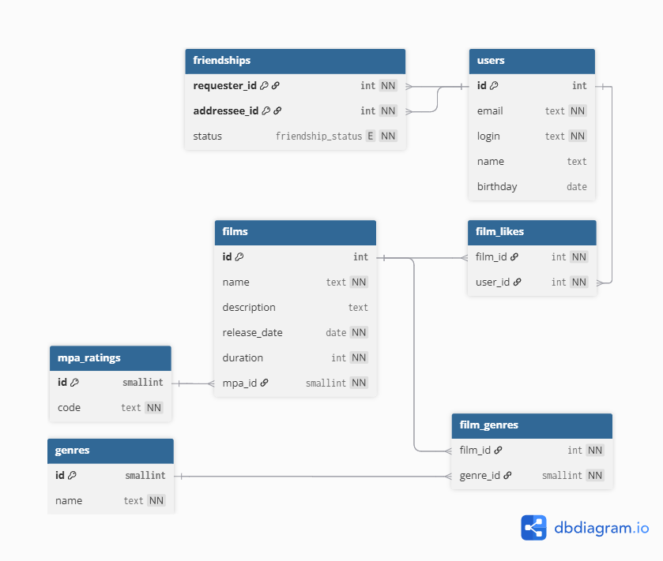

# 🎬 Filmorate — сервис рекомендаций фильмов

**Filmorate** — это учебный проект на Java для работы с рейтингами фильмов и социальными связями пользователей.  
Сервис хранит информацию о фильмах, жанрах, лайках и дружбе между пользователями.

---

## Схема базы данных

Ниже представлена ER-диаграмма, спроектированная для Filmorate.  
Она отображает связи между пользователями, фильмами, жанрами, лайками и статусами дружбы.




---

## Основные таблицы

| Таблица       | Назначение                                                |
|---------------|-----------------------------------------------------------|
| `users`       | Пользователи приложения                                   |
| `films`       | Фильмы с описанием, длительностью и MPA-рейтингом         |
| `genres`      | Справочник жанров                                         |
| `film_genres` | Связь фильмов с жанрами                                   |
| `film_likes`  | Лайки пользователей к фильмам                             |
| `friendships` | Дружба пользователей со статусами `PENDING` и `CONFIRMED` |
| `mpa_ratings` | Возрастные рейтинги Motion Picture Association (MPA)      |

---

## Примеры запросов

### 1. Добавить фильм

```sql
INSERT INTO films (name, description, release_date, duration, mpa_id)
VALUES ('Inception', 'Фантастический триллер', '2010-07-16', 148, 4);
```

### 2. Добавить жанры к фильму

```sql
INSERT INTO film_genres (film_id, genre_id)
VALUES (1, 2), (1, 5);
```

### 3. Пользователь ставит лайк фильму

```sql
INSERT INTO film_likes (film_id, user_id)
VALUES (1, 3);
```

### 4. Отправить запрос в друзья

```sql
INSERT INTO friendships (requester_id, addressee_id, status)
VALUES (1, 2, 'PENDING');
```

### 5. Подтвердить дружбу

```sql
UPDATE friendships
SET status = 'CONFIRMED'
WHERE requester_id = 1 AND addressee_id = 2;
```

### 6. Получить топ-3 жанра, которые пользователь лайкал чаще всего

```sql
SELECT g.name AS genre_name, COUNT(*) AS like_count
FROM film_likes fl
JOIN film_genres fg ON fg.film_id = fl.film_id
JOIN genres g ON g.id = fg.genre_id
WHERE fl.user_id = :user_id
GROUP BY g.id, g.name
ORDER BY like_count DESC
LIMIT 3;
```